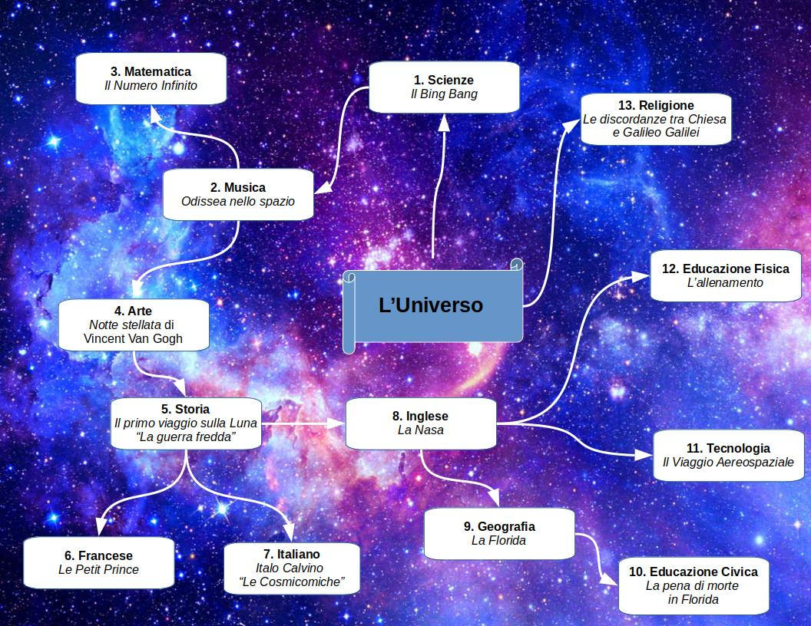

==========
L'Universo
==========

Oggi vi presenterò la mia tesina che parla dell’**Universo** e di tutto ciò che lo compone.

Ho scelto quest’argomento perché fin da piccolo sono stato affascinato da tutto ciò che compone l'Universo: pianeti, stelle, galassie, buchi neri, Via Lattea ecc..

Da sempre sono stato un amante di film di fantascienza che parlano di viaggi nello **spazio infinito** quali Star Trek e Star Wars.

Viaggi che, quando verranno fatti con continuità, saranno utili a soddisfare la sete di esplorazione che, da sempre, caratterizza il genere umano.

Senza di essa i nostri antenati non sarebbero mai usciti dall'Africa e non avremmo mai messo piede sulla Luna né costruito una base spaziale.

Una domanda che ci poniamo ormai da secoli è: **siamo soli nell’Universo?**

La tecnologia si è sviluppata al punto che forse tra poco potremmo avere questa risposta. Il **telescopio spaziale Kepdler** ha individuato pianeti molto simili alla Terra al di fuori del
Sistema Solare e quindi è probabile che, come sulla Terra, anche lì ci sia qualche forma di vita.

**"In un universo infinito, deve esserci altra vita. Non vi è dubbio più grande. E’ tempo di impegnarsi per trovare una risposta."  Cit. Stephen Hawking**

**Mappa Concettuale**

.. toctree::
   :maxdepth: -1

   scienze
   musica
   matematica
   arte
   storia
   francese
   letteratura
   inglese
   geografia
   scienze_motorie
   tecnologia
   cittadinanza_costituzione
   religione
