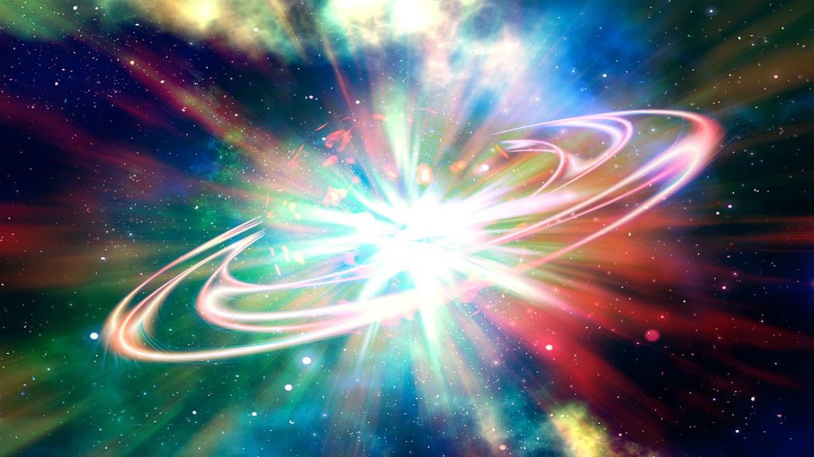

=======
Scienze
=======

La nascita dell'Universo
========================

A una frazione di secondo dal Big Bang l'Universo era un milione di miliardi di volte più piccolo di un atomo, ed era anche un quadrilione di volte più caldo del centro del Sole.

Da questo minuscolo e super energetico inizio presero avvio l'espansione e il progressivo (in tempi cosmici) raffreddamento.

Il Bing Bang
------------

**Big Bang** è un modello cosmologico basato sull'idea che l'universo iniziò a espandersi a velocità elevatissima in un tempo finito nel passato a partire da una condizione di curvatura,
temperatura e densità estreme, e che questo processo continui tuttora.

Gli scienziati lavorano senza sosta per capire cosa avesse formato quest’immane esplosione ma ancora oggi è un campo ignoto.

Una teoria la più sensata fino ad ora dice che l’universo era compattato in un piccolissimo spazio ad elevatissime temperature.

Poi circa 4,6 miliardi di anni fa avvenne un immane esplosione ( il Big Bang ) che proiettò tutta la materia nell’infinito dell’universo.

La teoria del **Big Bang** è avvalorata dal fatto che le galassie sono ancora in movimento nell’universo.

Gli scienziati hanno formulato varie teorie sull'evoluzione dell'universo:

* che quando l’energia dell’esplosione finirà le galassie si fermeranno;

* che l’energia dell’esplosione dopo che terminerà l’universo ritornerà a compattarsi come allo stato iniziale e quindi ricomincerà il ciclo.

* che l‘universo continuerà ad espandersi all‘infinito.
